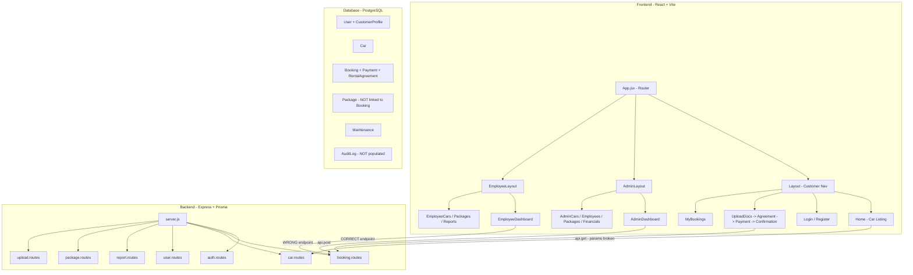

# Teddy Car Rental Fleet Management System — Codebase Audit Report

## Executive Summary

After a thorough review of the entire codebase (backend + frontend), I identified **25+ issues** ranging from critical bugs that break functionality to incomplete features and code quality concerns. The issues are categorized by severity below.

---

## 🔴 CRITICAL — Breaks Functionality

### 1. Frontend `api.get()` Does Not Support Query Parameters
- **File:** [`api.js`](frontend/src/api.js:4) — the `apiRequest` function
- **File:** [`Home.jsx`](frontend/src/pages/Home.jsx:59) — `api.get('/cars', { params })`
- **Problem:** The `api.get()` wrapper passes an `options` object with a `params` key, but `apiRequest()` never reads `options.params` to build a query string. The `params` object is silently ignored, meaning **date-based car availability filtering on the Home page never works**. All cars are always fetched without date filters.
- **Impact:** Customers cannot filter cars by availability dates. The date pickers on the Home page are non-functional.
- **Fix:** Add query string serialization in `apiRequest()` or build the URL manually in `Home.jsx`.

### 2. Admin Dashboard Uses Wrong API Endpoint for Booking Status Updates
- **File:** [`AdminDashboard.jsx`](frontend/src/pages/admin/AdminDashboard.jsx:75)
- **Problem:** Calls `api.patch('/bookings/${id}', { status })` but the backend route is `PATCH /bookings/:id/status`. The `/status` suffix is missing.
- **Impact:** Admin booking approve/reject actions from the dashboard will return **404 errors** or hit the wrong route.
- **Fix:** Change to `api.patch('/bookings/${id}/status', { status })`.

### 3. Prisma Schema Missing `datasource url`
- **File:** [`schema.prisma`](backend/prisma/schema.prisma:7)
- **Problem:** The `datasource db` block only has `provider = "postgresql"` but no `url` field. While the app uses `prisma.config.js` to supply the URL at runtime, this is a non-standard setup that may cause issues with `prisma migrate`, `prisma db push`, and other CLI commands that expect the URL in the schema.
- **Impact:** Prisma CLI commands may fail without the `--config` flag. New developers will be confused.

### 4. Duplicate/Conflicting Prisma Client Instances
- **Files:** [`backend/src/utils/prismaClient.js`](backend/src/utils/prismaClient.js:1) and [`backend/lib/prisma.js`](backend/lib/prisma.js:1)
- **Problem:** Two different Prisma client files exist:
  - `src/utils/prismaClient.js` — uses `@prisma/adapter-pg` with a connection pool (the one actually used)
  - `lib/prisma.js` — uses standard `@prisma/client` directly (unused but confusing)
- **Impact:** The `lib/prisma.js` file imports from `@prisma/client` which may not even have the generated client (since output is set to `../src/generated/prisma`). This is dead code that could cause confusion.
- **Fix:** Delete `backend/lib/prisma.js`.

### 5. `.env` Missing `JWT_SECRET`
- **File:** [`backend/.env`](backend/.env:12)
- **Problem:** The `.env` file only contains `DATABASE_URL`. There is no `JWT_SECRET` defined.
- **File:** [`jwt.js`](backend/src/utils/jwt.js:4) falls back to `'your_super_secret_key'`
- **Impact:** In production, all JWTs are signed with a hardcoded, publicly visible secret key. This is a **severe security vulnerability**.
- **Fix:** Add `JWT_SECRET=<strong-random-value>` to `.env` and remove the fallback.

---

## 🟠 HIGH — Significant Bugs or Missing Functionality

### 6. Missing Pages: About, Contact, Terms, Privacy
- **File:** [`Layout.jsx`](frontend/src/components/Layout.jsx:48) — links to `/about`, `/contact`, `/terms`, `/privacy`
- **File:** [`App.jsx`](frontend/src/App.jsx:42) — no routes defined for these paths
- **Problem:** The navigation header and footer link to `/about`, `/contact`, `/terms`, and `/privacy`, but no corresponding page components or routes exist.
- **Impact:** Clicking these links shows a blank page (no 404 page either).

### 7. Ghost Files in Open Tabs — Missing Source Files
- **Open tabs reference files that do NOT exist in the file system:**
  - `backend/src/app.js` — does not exist (server.js is the entry point)
  - `backend/src/middlewares/rbac.middleware.js` — does not exist (auth.middleware.js has the `authorize` function)
  - `backend/src/routes/vehicle.routes.js` — does not exist (car.routes.js is used)
  - `backend/src/controllers/vehicle.controller.js` — does not exist (car.controller.js is used)
  - `backend/test_import.js` — does not exist in the file listing
- **Impact:** These may be remnants of a refactoring. If any code imports from these paths, it will crash at runtime.

### 8. `helmet` and `morgan` Installed But Never Used
- **File:** [`package.json`](backend/package.json:24) — lists `helmet` and `morgan` as dependencies
- **File:** [`server.js`](backend/server.js:1) — neither is imported or used
- **Impact:** Missing security headers (helmet) and request logging (morgan). These are important for production.
- **Fix:** Add `app.use(helmet())` and `app.use(morgan('dev'))` to `server.js`.

### 9. Express 5 Compatibility Concern
- **File:** [`package.json`](backend/package.json:23) — `"express": "^5.2.1"`
- **Problem:** Express 5 is being used. Express 5 has breaking changes from Express 4, including changes to how `res.json()`, `res.send()`, and error handling work. The error middleware pattern and route handlers may need adjustments.
- **Impact:** Potential subtle runtime issues. Express 5 also returns promises from `res.send()` etc., which could cause unhandled promise rejections.

### 10. `updateProfile` Blocks Non-CUSTOMER Users
- **File:** [`auth.controller.js`](backend/src/controllers/auth.controller.js:129)
- **Problem:** The `updateProfile` endpoint returns 400 for non-CUSTOMER roles: `"Only customers have profiles"`. However, the seed data creates `CustomerProfile` records for ADMIN and EMPLOYEE users too.
- **Impact:** Inconsistency — profiles are created for all roles during registration/seeding, but only customers can update them.

### 11. Confirmation Page References Wrong Field Name
- **File:** [`Confirmation.jsx`](frontend/src/pages/Confirmation.jsx:57)
- **Problem:** References `booking?.car?.licensePlate` but the Prisma schema and backend use `plateNumber` as the field name.
- **Impact:** The receipt PDF will always show "N/A" for the vehicle registration number.
- **Fix:** Change to `booking?.car?.plateNumber`.

### 12. No Employee Login Page — Employees Must Use Customer Login
- **Problem:** There is an `AdminLogin` page at `/admin/login`, but no dedicated employee login page. Employees must use the customer login at `/login`.
- **File:** [`Login.jsx`](frontend/src/pages/Login.jsx:25) — redirects EMPLOYEE role to `/employee/dashboard`
- **Impact:** This works functionally but is confusing UX. The `ProtectedRoute` for employee routes redirects unauthenticated users to `/login` (customer login), not a dedicated employee login.

### 13. Car Deletion Fails If Car Has Completed/Cancelled Bookings
- **File:** [`car.controller.js`](backend/src/controllers/car.controller.js:149)
- **Problem:** `prisma.car.delete()` will fail with a foreign key constraint error if the car has ANY bookings (even completed/cancelled ones), because the check only looks for active bookings but the delete doesn't cascade.
- **Impact:** Cars with historical bookings can never be deleted.
- **Fix:** Either add `onDelete: Cascade` to the Booking-Car relation, or soft-delete cars.

---

## 🟡 MEDIUM — Functional Issues and Code Quality

### 14. `Logout.jsx` May Cause Infinite Re-render
- **File:** [`Logout.jsx`](frontend/src/pages/Logout.jsx:11)
- **Problem:** `useEffect(() => { logout(); }, [logout])` — if `logout` is not memoized with `useCallback` in `AuthContext`, this could cause re-renders. Looking at [`AuthContext.jsx`](frontend/src/context/AuthContext.jsx:42), `logout` is defined as a plain function, so it gets a new reference on every render.
- **Impact:** Potential infinite re-render loop on the logout page.
- **Fix:** Wrap `logout` in `useCallback` in `AuthContext`.

### 15. `Payment.jsx` Sends `packageId` But Backend Ignores It
- **File:** [`Payment.jsx`](frontend/src/pages/Payment.jsx:96) — sends `packageId` in the booking payload
- **File:** [`booking.controller.js`](backend/src/controllers/booking.controller.js:5) — does not destructure or use `packageId`
- **Problem:** The `Package` model has no relation to `Booking` in the schema. Packages are displayed but never linked to bookings.
- **Impact:** Package selection on the payment page is cosmetic only — it has no effect on the booking.

### 16. `dailyRate` Is a Prisma `Decimal` — Frontend May Not Handle It Correctly
- **File:** [`schema.prisma`](backend/prisma/schema.prisma:44) — `dailyRate Decimal`
- **File:** [`Payment.jsx`](frontend/src/pages/Payment.jsx:75) — `car.dailyRate * durationDays`
- **Problem:** Prisma returns `Decimal` fields as strings (or Decimal.js objects), not JavaScript numbers. Multiplying a string by a number gives `NaN`.
- **Impact:** The rental fee calculation on the Payment page may show `NaN` or `0`.
- **Fix:** Use `parseFloat(car.dailyRate)` or `Number(car.dailyRate)` before arithmetic.

### 17. No 404/Catch-All Route
- **File:** [`App.jsx`](frontend/src/App.jsx:41)
- **Problem:** No catch-all `<Route path="*" element={<NotFound />} />` exists.
- **Impact:** Navigating to any undefined URL shows a blank page instead of a helpful 404 page.

### 18. `sessionStorage` Dependency for Booking Flow
- **Files:** [`Home.jsx`](frontend/src/pages/Home.jsx:20), [`Payment.jsx`](frontend/src/pages/Payment.jsx:63)
- **Problem:** The booking flow relies on `sessionStorage` for `startDate`, `endDate`, `idCardUrl`, `licenseUrl`, and `lastBookingId`. If the user opens a new tab or the session is cleared, the booking flow breaks silently.
- **Impact:** Fragile booking flow that can lose state.

### 19. `mockCars.js` Is Unused Dead Code
- **File:** [`mockCars.js`](frontend/src/data/mockCars.js:1)
- **Problem:** This file contains hardcoded mock car data but is never imported anywhere. The app fetches real data from the API.
- **Impact:** Dead code that should be removed.

### 20. `backend/package.json` Has Wrong `main` Entry
- **File:** [`package.json`](backend/package.json:4) — `"main": "index.js"`
- **Problem:** The entry point is `server.js`, not `index.js`. The `main` field is incorrect.
- **Impact:** Minor — only affects programmatic imports of the package, not `npm start`.

### 21. No Input Validation on Backend
- **Problem:** None of the controllers validate input beyond basic existence checks. No validation library (like `joi`, `zod`, or `express-validator`) is used.
- **Examples:**
  - [`auth.controller.js`](backend/src/controllers/auth.controller.js:7) — no email format validation, no password strength check
  - [`car.controller.js`](backend/src/controllers/car.controller.js:83) — no validation that `year` is a valid number, `dailyRate` is positive, etc.
- **Impact:** Malformed data can be stored in the database.

---

## 🔵 LOW — Minor Issues and Improvements

### 22. `updateCar` Passes Raw `req.body` to Prisma
- **File:** [`car.controller.js`](backend/src/controllers/car.controller.js:115)
- **Problem:** `const data = req.body; ... prisma.car.update({ data })` — this passes the entire request body directly to Prisma, which could allow updating fields that shouldn't be user-modifiable (like `id`, `createdAt`).
- **Fix:** Whitelist allowed fields.

### 23. `updatePackage` Has Same Raw Body Issue
- **File:** [`package.controller.js`](backend/src/controllers/package.controller.js:41)
- **Same issue as #22.**

### 24. No CORS Configuration
- **File:** [`server.js`](backend/server.js:23) — `app.use(cors())`
- **Problem:** CORS is wide open with no origin restrictions. In production, this should be restricted to the frontend domain.

### 25. Hardcoded Insurance Fee
- **File:** [`Payment.jsx`](frontend/src/pages/Payment.jsx:74) — `const insuranceFee = 1000;`
- **Problem:** Insurance fee is hardcoded. Should come from the backend or be configurable.

### 26. No Pagination on List Endpoints
- **Files:** All `findMany` calls in controllers return all records with no pagination.
- **Impact:** Performance will degrade as data grows.

### 27. `seed.js` Creates a Booking Every Time It Runs
- **File:** [`seed.js`](backend/prisma/seed.js:133) — uses `prisma.booking.create()` not `upsert`
- **Impact:** Running seed multiple times creates duplicate bookings.

---

## Architecture Diagram

---

## Summary of Fix Priority

| Priority | Count | Key Items |
|----------|-------|-----------|
| 🔴 Critical | 5 | API params broken, wrong endpoint, JWT secret, duplicate prisma, schema url |
| 🟠 High | 8 | Missing pages, ghost files, no helmet/morgan, Express 5, car deletion, field name mismatch |
| 🟡 Medium | 8 | Infinite re-render, Decimal handling, no 404, sessionStorage fragility, no validation |
| 🔵 Low | 6 | Raw body updates, CORS, hardcoded values, no pagination |

---

## Recommended Fix Order

1. Fix `api.get()` query parameter support (Critical - breaks car filtering)
2. Fix AdminDashboard wrong endpoint `/bookings/${id}` → `/bookings/${id}/status` (Critical)
3. Add `JWT_SECRET` to `.env` and remove hardcoded fallback (Critical - security)
4. Fix `Confirmation.jsx` field name `licensePlate` → `plateNumber` (High)
5. Fix `Decimal` handling for `dailyRate` in Payment page (Medium)
6. Add `helmet` and `morgan` to `server.js` (High - security/logging)
7. Wrap `logout` in `useCallback` in AuthContext (Medium - potential crash)
8. Add missing pages or remove dead links (High - UX)
9. Delete dead code: `lib/prisma.js`, `mockCars.js` (Low - cleanup)
10. Add a 404 catch-all route (Medium - UX)
11. Add input validation to backend controllers (Medium - security)
12. Fix car deletion foreign key issue (High - functionality)
